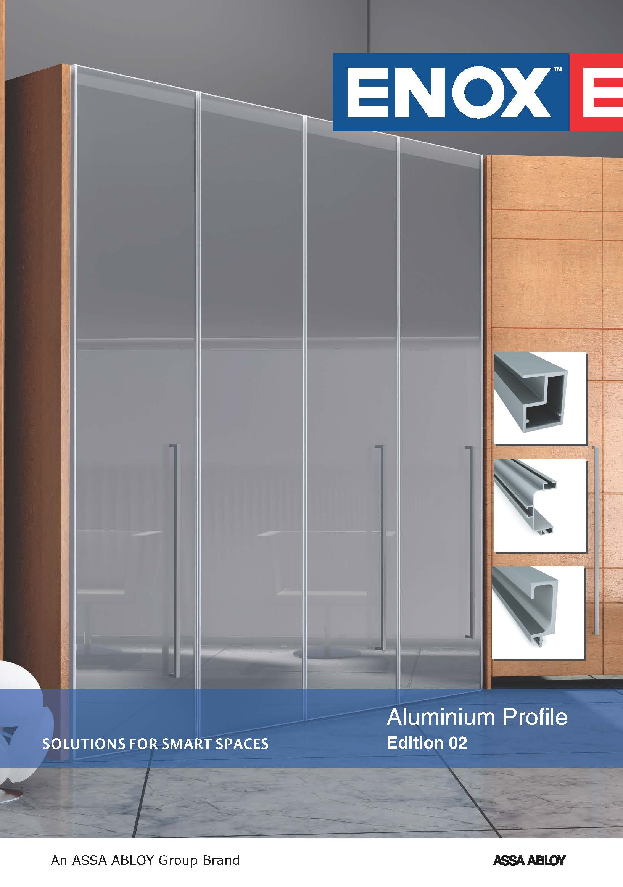

Offered Aluminium profiles are extensively used as components in building, enhancing the appearance of your kitchen cabinet doors, Office interiors.Aluminium is a relatively soft, durable, lightweight, ductile, and malleable metal with appearance ranging from silvery to dull gray, depending on the surface roughness.

